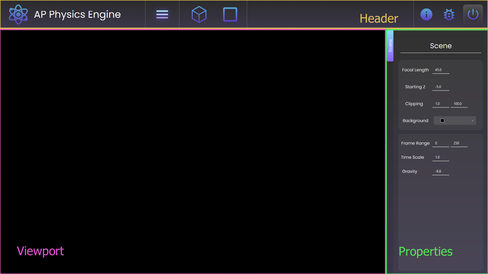
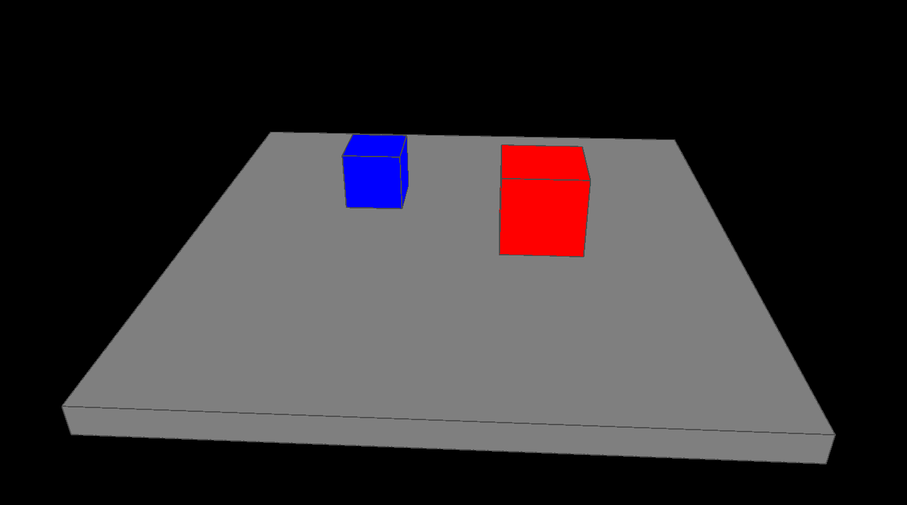

# AP Physics Engine

AP Physics Engine is a 3D Java based program that allows you to simulate concepts that are learnt in AP Physics 1.

***

## Installing Dependencies

The following dependencies should already be built into the program.

- [Java SE 11 (LTS)](https://www.oracle.com/java/technologies/javase-downloads.html)

- [JavaFX 11](https://gluonhq.com/products/javafx/)

- [Jogl](https://jogamp.org/deployment/jogamp-current/archive/)

However if they are not..

1. Install the [JavaFX SDX](https://gluonhq.com/products/javafx/)

2. Follow the [JOGL installation guide](https://www.tutorialspoint.com/jogl/jogl_installation.htm)

3. Create the folder `C://src`, and create subdirectories for `jogl` and `javafx`.

4. Copy all `jogl` files into the `jogl` folder.

5. Copy all `javafx` files in the `javafx` folder.

6. The app should then be able to access the needed depencies for the project.

## User Interface

There are 3 panels in the app: [Header](https://github.com/Christopher-Hosken/ap_physics_engine/blob/main/README.md#header), [Viewport](https://github.com/Christopher-Hosken/ap_physics_engine/blob/main/README.md#viewport), [Properties](https://github.com/Christopher-Hosken/ap_physics_engine/blob/main/README.md#properties).


***

### Header

The header panel is located at the top of the Physics Engine application. There are 7 buttons that do basic functions in the app.

<br>

*Logo*
: Reset the app. This will destroy all objects in the scene.

*Menu*
: Toggle the visibility of the properties panel *(toggleable)*.

*Cube*
: Generate a default cube at the world center.

*Wire*
: Toggle wireframe view of all the objects *(toggleable)*.

*Demo*
: Generate the demo scene.

*Info*
: Open README file.

*Bug*
: Open Github issues page.

*Quit*
: Exit the application.

<br>

Any active or pressed buttons will have a highlighted glow around them. As well as this, grabbing and dragging the header will move the entire application.

***

### Viewport

The viewport has been designed for easy control. Users are able to zoom, pan, and rotate around the scene.

<br>

#### **Mouse and Keyboard**

*Zoom*
: Scroll-wheel

*Pan*
: Middle-mouse

*Rotate*
: Left-mouse

*Reset*
: Home

<br>

#### **Trackpad and Laptop Keyboard**

*Zoom*
: Right-mouse

*Pan*
: Shift-left-mouse

*Rotate*
: Left-mouse

*Reset*
: Alt-/

<br>

#### **Shortcuts**

*Pause / play*
: Spacebar

*Reset simulation*
: Alt-spacebar

*Reset object location*
: Alt-g

*Reset object scale*
: Alt-s

*Delete*
: X

<br>

***

### Selection

To select and object, simply hover over it with your mouse and left click. Selected objects should have a yellow highlight, and its color should brighten. There is no way to deselect an object, and you cannot select more than one object.

***

### Clipping

If you start zooming in or out, you may reach a point where your objects start to dissapear *(or appear to be cut off)*. This has to do with limtations with the 3d rendering engine, and can be fixed in the properies panel.

***

## Properties

The properties panel is where users will spend most of their time. Here they can customize the scene and prepare the objects for simulations.

### Scene Properties

The scene properties can be used to control the world in the which the simulations take place.

*Starting Z*
: The starting distance from the center of the world.

*Clipping*
: Near and far clipping values.

*Background*
: Set the color of the world background.

*Frame Range*
: Set the starting and ending values of the simulation.

*Force Scale*
: Set the strength at which forces are applied.

*Gravity*
: Set the force of gravity acting on the world.

<br>

### Object Properties

The object properties panel will appear when an object is a selected. Most of the controls are pretty self explanatory.

*Location*
: set the (x, y, z) location of the object.

*Scale*
: set the (x, y, z) scale of the object.

*Color*
: set the display color of the object.

*Show origin*
: show the origin point of the object *(toggleable)*.

*Show normals*
: override the display color of the object with the object normals *(toggleable)*.

*Active*
: toggle whether the object is passive or active (can be affected by forces) *(toggleable)*.

*Velocity*
: set the initial (x, y, z) velocity of the object.

*Velocity*
: toggle the velocity vector visibilty *(toggleable)*.

*Acceleration*
: toggle the acceleration vector visibility *(toggleable)*.

<br>

## Demo Scene

The demo scene is a premade physics simulation that is computed entirely by the physics engine. This scene is used to demo the capabilities of the Physics engine.


## The Physics

Although the Physics engine was planned to contain more concepts from AP Physics 1, many features had to be removed due to time concerns. This means that only Forces and Momentum were able to be implemented, and the only objects in the scenes were cubes.

### Gravity

Applying gravity was very simple. Every time the viewport updated I would apply a gravitational force on the object. From there, the object would then apply that force to change its velocity and position.

1. Apply force to object.
2. The Object divides the applied force by it's mass to obtain the acceleration.
3. The acceleration is then added to the velocity vector.
4. The position of the object is updated based on the velocity.
5. Repeat every viewport update.

```java
// example code
public static applyForce(Object obj, vec3 force)
  // F = ma
  // x = vt
  // v = vi + at
  
  vec3 acceleration = force / mass; // a = F / m
  obj.velocity += acceleration; // v = vi + a(t): t = 1
  obj.position += obj.velocity; // x = v(t): t = 1
```

This technique of using forces was written in mind of other applied forces, but due to time limitations I was unable to add more.

### Collisions

To detect where the cubes were colliding, I implemented a basic overlap test. The main idea for this came from an MDN article about [3D collision detection](https://developer.mozilla.org/en-US/docs/Games/Techniques/3D_collision_detection). I iterated through every vertex in the cube (only 4), and checked if they were inside the bounds of another object.

```java
// example code
for (vec3 point : object.verts) {
  if ((point.x >= cube.minX && point.x <= cube.maxX) && 
      (point.y >= cube.minY && point.y <= cube.maxY) && 
      (point.z >= cube.minZ && point.z <= cube.maxZ)) {
    return true;
  }
}

return false;
```

This simple collision detection allowed me to see when two cubes were intersecting, regardless of their scale or position.

### Transferring Momentum

Once the engine detects a collision, it transfers the momentum from one object to the other.

If the target object is not active, the momentum being transferred will esentiallly dissapear. *(This is not possible in the real world, but can be done digitally!)*
However, if the object is active, the momemtum of the original object will all be transferred to the momentum of the second object *(this is due to the law of conservation of momentum)*.

```java
// example code
onCollision(Object object, Object collider) {
  if (collider.active) {
    vec3 tmp = collider;
    collider.momentum = object.momentum;
    object.momentum = collider.momentum;
  }
  
  else {
    object.momentum = vec3(0, 0, 0);
  }
}
```

## Lessons Learnt

I learnt alot from creating the AP Physics Engine. I learnt how to design and program an entire GUI.

## Useful articles

- [JOGL Tutorial](https://www.tutorialspoint.com/jogl/index.htm)

- [Object Selection in OpenGL](http://www.opengl-tutorial.org/miscellaneous/clicking-on-objects/picking-with-an-opengl-hack/)

- [Detecting Cube Collisions](https://developer.mozilla.org/en-US/docs/Games/Techniques/3D_collision_detection)

- [Basic Syntax | Markdown Language](https://www.markdownguide.org/basic-syntax/)


## Present Bugs

The AP Physics engine has quite a few of bugs. Nothing that will cause the program to crash, but the code is definitely not up to proffessional standards.

> **JavaFX error on color changes:** When the color picker popup appears, an error message is displayed on about styling.
   I was unable to find any solutions to this error online as the JavaFX css documentation is very limited, but the error message does not hinder the program in any way.

***

> **Simulation issues:** Collisions sometimes do not happen between objects, and restarting the simulation sometimes causes glitches.
  Currently I am not aware of what is causing the glitches with collisions, but if I am planning to fix this bug sometime in the future.

***

> **Origin Offsetting:** When the simulation runs, the origin point of the cube will start to offset. I haven't been able to find the solution to this yet, but it should be an easy fix.

***

## Author

Released under the [GPL License](http://www.gnu.org/licenses/gpl-3.0.html).

Authored and mainatined by [Christopher Hosken](https://github.com/Christopher-Hosken)

- Email [hoskenchristopher@gmail.com](hoskenchristopher@gmail.com)

- Artstation [Christopher Hosken](https://www.artstation.com/christopherhosken)

- Linkedin [Christopher Hosken](https://www.linkedin.com/in/christopher-hosken-637a53186/)

- Discord [@cjhosken#7147]()